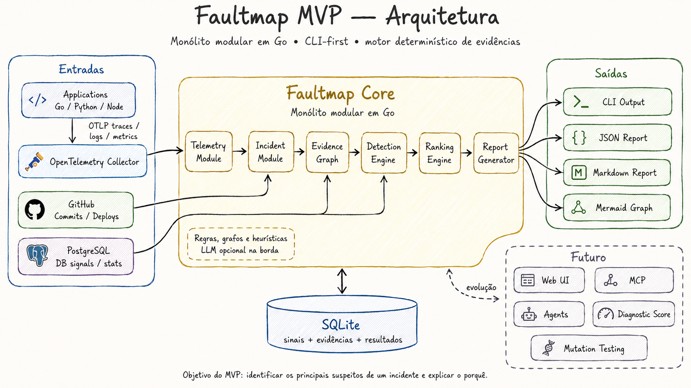

# Faultmap

> Investigação determinística de incidentes para aplicações backend.

O Faultmap recebe telemetria, compara o comportamento normal com uma janela de incidente e aponta os principais suspeitos — sempre mostrando as evidências, o score e as limitações da hipótese.



## O que estamos construindo

Um monólito modular em Go, distribuído como um único binário e orientado à CLI. Ele usa OpenTelemetry para reunir traces, logs e métricas; correlaciona esses sinais com deploys e commits do GitHub e operações PostgreSQL; persiste o contexto localmente em SQLite; e gera um ranking explicável de suspeitos.

Em vez de responder apenas “algo está errado”, o objetivo é responder:

> Para este serviço e esta janela de tempo, onde devemos começar a investigar e quais evidências sustentam essa prioridade?

Exemplo da experiência desejada:

```bash
faultmap diagnose incident \
  --service checkout \
  --since 30m \
  --baseline 60m \
  --environment staging
```

O resultado deve listar os suspeitos mais prováveis, suas contribuições de score e as limitações. Um deploy próximo, por exemplo, aumenta a prioridade de investigação, mas nunca é apresentado como prova de causalidade.

## Como funciona

1. Aplicações enviam traces, logs e métricas por OTLP ao OpenTelemetry Collector.
2. O Faultmap normaliza e armazena os sinais no SQLite.
3. Ao diagnosticar um incidente, ele compara a janela atual com uma baseline anterior.
4. Detectores determinísticos encontram mudanças como aumento de erros, latência, timeout de banco, retry storm e falhas em dependências.
5. Um grafo de evidências conecta serviços, traces, deploys, commits e operações de banco.
6. O mecanismo de ranking gera os principais suspeitos e relatórios em terminal, JSON, Markdown e Mermaid.

O motor de diagnóstico não depende de LLM. Integrações futuras com LLMs, agentes ou MCP apenas consumirão e explicarão os resultados estruturados.

## Escopo do MVP

- CLI em Go e banco SQLite local;
- ingestão OTLP e importação de fixtures;
- comparação entre incident e baseline;
- detectores determinísticos e ranking auditável;
- correlação inicial com GitHub e PostgreSQL;
- ambiente `demo-shop` reproduzível com Docker Compose;
- relatórios para terminal, JSON, Markdown e Mermaid.

Interface web, Kubernetes, Neo4j, Kafka, SaaS e LLM obrigatória estão fora do primeiro MVP.

## Desenvolvimento local

### Requisitos

- Go `1.24.0` ou compatível com a versão declarada em [`go.mod`](go.mod);
- `make`, para executar os atalhos de qualidade.

Não é necessário instalar o binário globalmente para trabalhar no projeto. Os comandos abaixo usam o código local; o Go baixa as dependências declaradas em `go.mod` quando necessário.

### Verificações de qualidade

Execute estes comandos na raiz do repositório:

```bash
make fmt
make test
make test-race
make vet
```

- `make fmt` aplica a formatação padrão do Go;
- `make test` executa a suíte de testes;
- `make test-race` executa a suíte com detecção de condições de corrida;
- `make vet` executa as verificações estáticas padrão do Go.

### Criar um workspace local

Crie um diretório exclusivo para os arquivos gerados pelo Faultmap:

```bash
go run ./cmd/faultmap init --directory ./faultmap-local
```

O comando imprime `Faultmap initialized.` e cria os seguintes artefatos dentro de `./faultmap-local`:

- `faultmap.yaml`: configuração inicial local, sem tokens ou credenciais;
- `faultmap.db`: banco SQLite com o schema inicial migrado;
- `faultmap-out/`: diretório reservado para relatórios e outras saídas futuras.

O `init` não sobrescreve artefatos existentes. Para criar novamente o mesmo workspace, remova explicitamente apenas o diretório que você escolheu para ele:

```bash
rm -rf ./faultmap-local
```

Ainda não há uma demo executável (`demo-shop`) no repositório. Quando ela existir, sua limpeza será documentada junto ao Docker Compose correspondente; por enquanto, a remoção do workspace acima é toda a limpeza local necessária.

## Especificação

A especificação é modular e sua leitura completa é obrigatória antes de implementar ou revisar o projeto. Comece por [FAULTMAP_MVP.md](FAULTMAP_MVP.md), que direciona para todos os documentos normativos em [`docs/mvp/`](docs/mvp/).

## Estado atual

O Marco 1 está em andamento. A CLI já oferece `faultmap init`, com configuração YAML, SQLite e migrations iniciais. A próxima etapa é concluir o bootstrap e as verificações das migrations antes de criar o `demo-shop` e iniciar a ingestão de telemetria.
